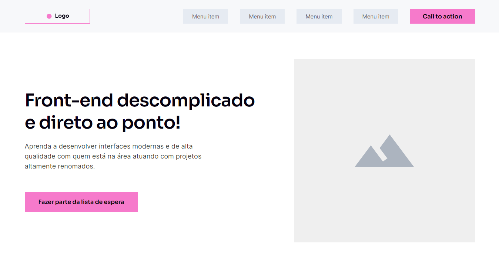

# Codeboost

- Repositório para divulgação dos projetos criados durante o curso Codeboost

---

## Projetos

- Sites desenvolvidos durante o curso

### Projeto #01 - Wireframe

- https://matheuscostadesign.github.io/codeboost/projeto01-wireframe/

### Projeto #02 - Hostinger

- https://matheuscostadesign.github.io/codeboost/projeto02-hostinger/
