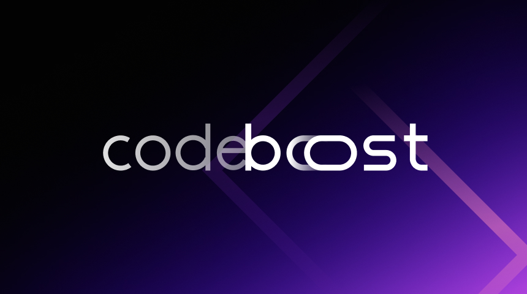
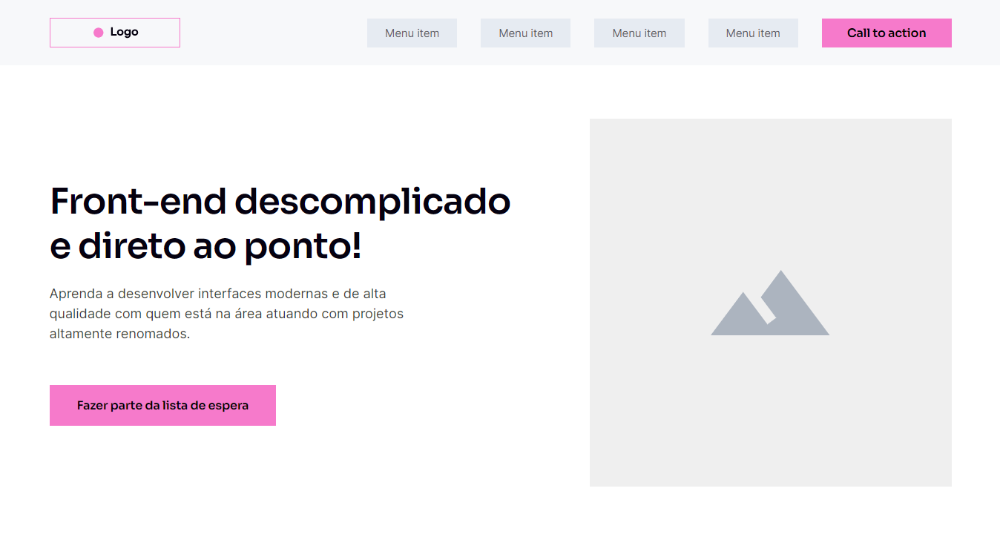

# Codeboost

- Repositório para divulgação dos projetos criados durante o curso Codeboost

---

### O que é SASS?

- SASS é um pré-processador de CSS
- https://scout-app.io/

## Projeto #01 - Wireframe

- https://matheuscostadesign.github.io/codeboost/projeto01-wireframe/
